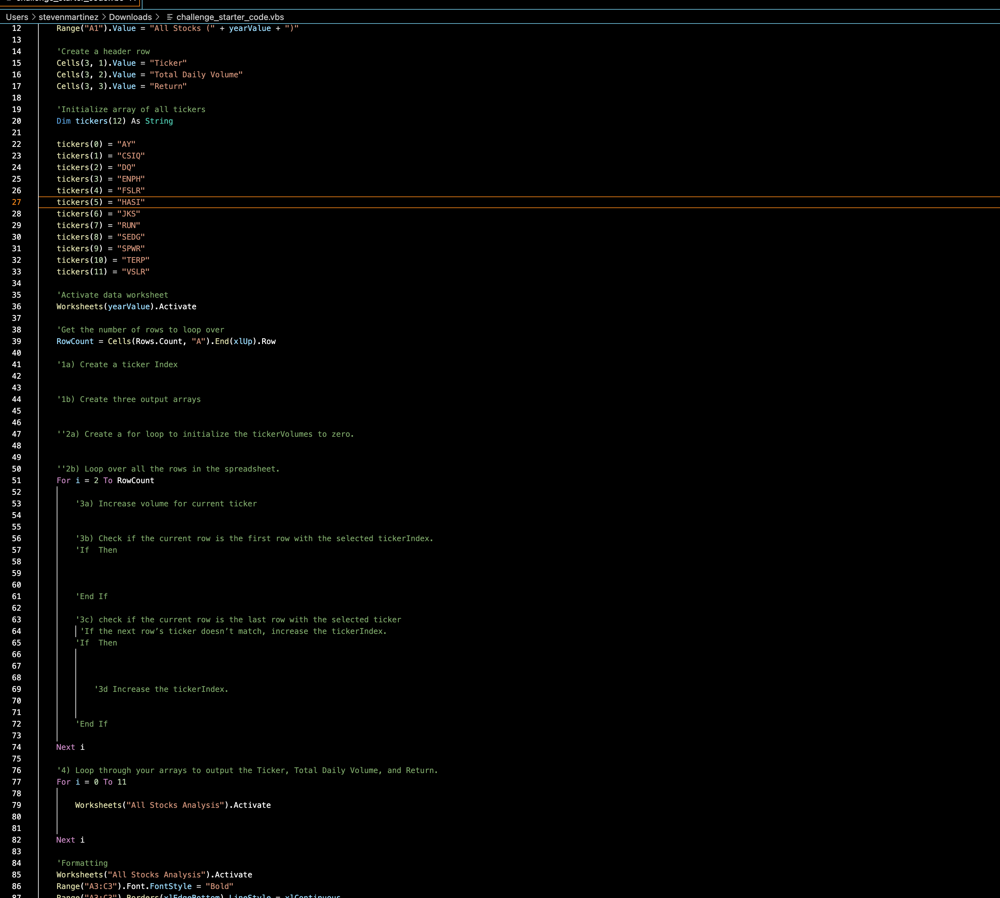

# Stock-Analysis-Project

## Overview:
In this project I worked on editing,refactoring, and creating code to loop through stock data from 2017-2018. The objective was to use Microsoft Excel VBA code to collect certain stock information for those years and to determine whether or not the stocks are worth investing. Since refactoring is a key part of the coding process. I did my best to refactor the code, by trying to make the code more efficient—by taking fewer steps, using less memory, and improving the logic of the code to make it easier for future users to read. The data used for this project was two large sheets of stocks from 2017-2018, which the primary focus was on green energy stocks. Using this data a another sheet names "All Stocks Analysis" was created in order to display the pulled information using VBA Macros. 

## Results:
To start the project I downloaded the project to start the refactoring process. The start of the project is mainly a skeleton that has to be completed in order to get the ideal information and run time from the code. 

## Summary:

### 1. What are the advantages or disadvantages of refactoring code?
Advantages of Code Refactoring:

One of the advantages of code refactoring is it makes the code can be the code is cleaner, easier to understand or read, less complex and easier to maintain.

Disadvantages of Code Refactoring:

One major disadvantage is that it is a time consuming proccess that requires a lot of time to go over the previous code. 

### 2.How do these pros and cons apply to refactoring the original VBA script?

When refactoring the orginal VBA script the pros can out weight the cons when you know what you are working with.
Using the orginal VBA script helped in understanding the code but did slow me down when trying to make it more efficient.The reason maybe because the orignal code was only used to pull data from the 2018 year which worked with no issues. Meanwhile when I tried to create the code to run for both 2017 and 2018 I struggled to get the code to run smoothly. By refactoring the code I found myself reading and looking up alot of different code to see what I could do to make the code more efficient. Which resulted in me taking alot of time to see what I was missing and why wouldnt the code run corrrectly. 
